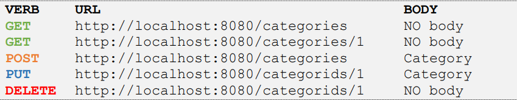
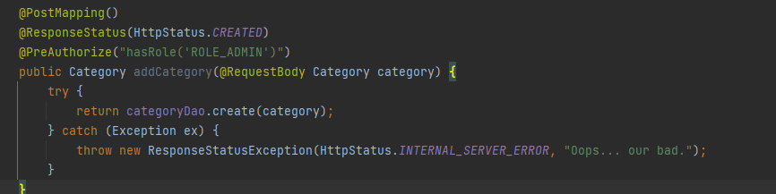
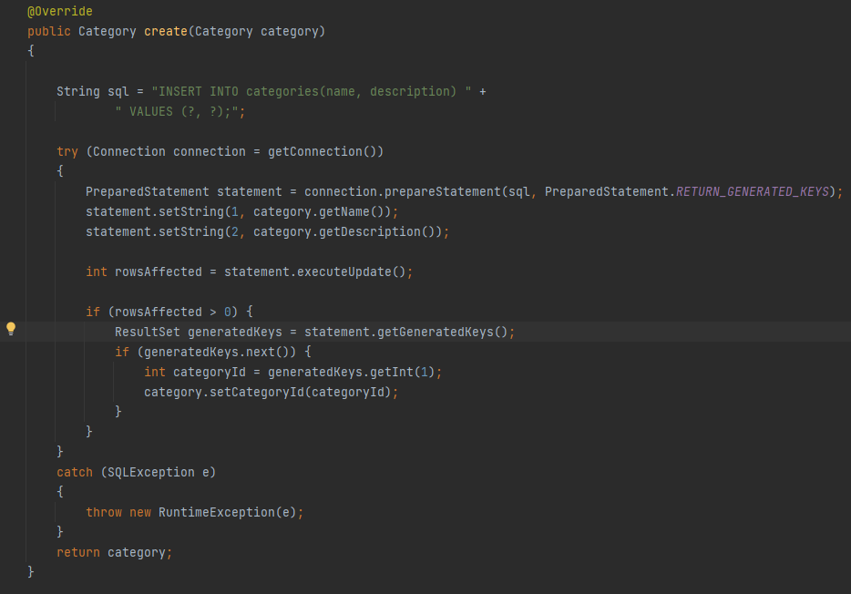
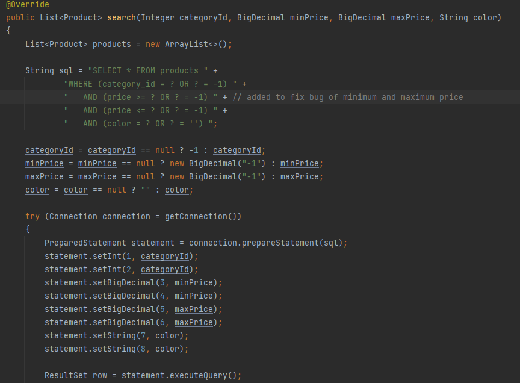
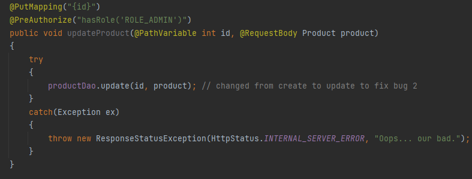
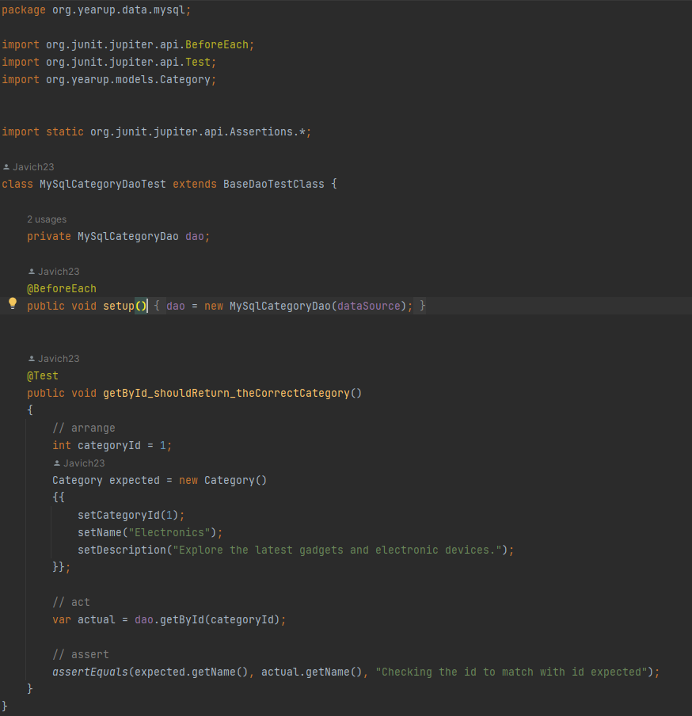

# E-Commerce API: EasyShop
___
This project is an e-commerce application or online store for a company called
EasyShop. 
## Overview
___
Web Application Features:
* List of items for sale
* Filter options(Category, Price, Color)
* Ability to add items to cart
* Header Options(Home,Profile,View Cart, Login/Logout)

To run application, the front end component (EasyShopFrontEnd) is required to format the website 
and the information sent by the backend portion.

### Phase 1 -  CategoriesController:
___
Phase 1 required implementing the methods inside the CategoriesController 
and MySqlCategoryDao class while assigning the proper annotations to the controller. 

List of implemented methods:
* getAll()
* getById()
* getProductsById()
* addCategory()
* updateCategory()
* deleteCategory()

REST methods required:

CategoriesController addCategory() method implementation:

MySqlCategoryDao create() method implementation:

### Phase 2 -  Fix Bugs:
___

For bug 1, the product search functionality is returning incorrect results.
All that was required to fix this bug was to add a maximum price line in 
the sql statement. The maxPrice was also added twice inside the try/catch code.

For bug 2, products would be duplicated because instead of updating the product,
a new product would be added to the database. To fix this all that was required was to
change create to update in below method.

## Interesting Piece of Code
___

MySqlCategoryDaoTest:

